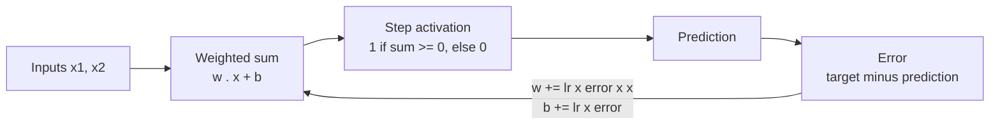

# Perceptron from Scratch

A single-layer perceptron written in plain NumPy: the learning rule, the training loop and the decision boundary, with no machine learning framework doing the work.

`Python` `NumPy` `Matplotlib`

## Why this exists

This is the first project on this account: the perceptron update rule written by hand, to watch a line learn to separate two classes before reaching for a framework.

## How it works



| Part | Detail |
| --- | --- |
| Data | 100 random points in the unit square, labelled 1 when `x2 > x1 + 0.1` and 0 otherwise, so the classes are linearly separable |
| Model | Two weights and a bias, initialised to zero |
| Activation | Step function |
| Learning rule | For each sample, weights and bias move by the learning rate times the prediction error |
| Training | Learning rate 0.1, 1,000 passes over the training set |
| Evaluation | 80% train, 20% test, accuracy on the test points |
| Output | A scatter plot of the data with the learned decision boundary drawn through it |

The perceptron convergence theorem guarantees this rule finds a separating line when one exists, which is why the dataset is built to be separable.

## Running it

```bash
pip install numpy matplotlib scikit-learn
python perceptron.py
```

The script shows the dataset, prints the test accuracy, then shows the decision boundary. scikit-learn is used only to split the data.

## Where it stops

A single perceptron can only draw one straight line, so it cannot learn XOR or any other problem that is not linearly separable. Stacking layers and replacing the step function with a differentiable activation is the step from here to a neural network trained by backpropagation.

---

Built by [Yogdeep Benchimath](https://github.com/Yogdeep2004). More work on the [portfolio](https://deepwork-systems.vercel.app/).
